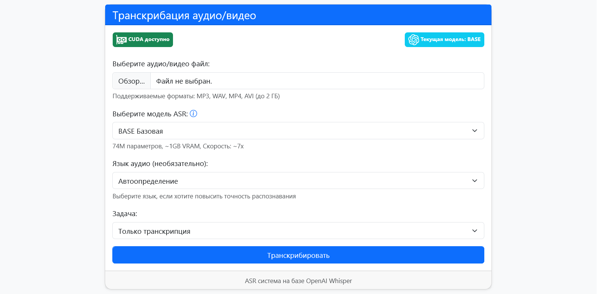
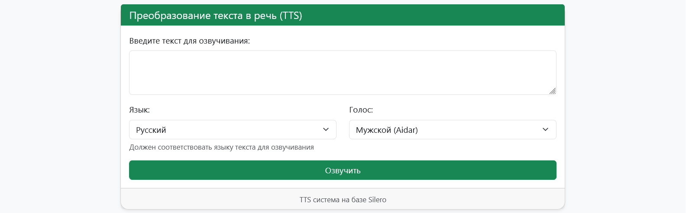

# README: Веб-приложение для транскрибации и обработки речи

## Описание проекта
Веб-приложение для комплексной работы с речью, включающее:
1. Автоматическое распознавание речи (ASR) с использованием Whisper
2. Обработку текста через GigaChat API (коррекция, суммаризация, перевод)
3. Синтез речи (TTS) с помощью Silero Models

Проект разработан как курсовая работа по дисциплине "Системы ИИ" и демонстрирует навыки интеграции современных ML-моделей в веб-приложение.




## Ключевые возможности
- **Транскрибация** аудио/видео файлов (MP3, WAV, MP4, AVI)
- **Обработка текста**:
  - Коррекция и форматирование
  - Суммаризация
  - Перевод на другие языки
- **Синтез речи** из текста с выбором языка и голоса
- Поддержка **различных моделей** Whisper (от Tiny до Large)
- **Адаптивный интерфейс** на Bootstrap

## Технологический стек
| Компонент       | Технологии/Библиотеки         |
|-----------------|-------------------------------|
| **Backend**     | Python, Flask                 |
| **ASR**         | OpenAI Whisper (PyTorch)      |
| **LLM**         | GigaChat API                  |
| **TTS**         | Silero Models                 |
| **Frontend**    | HTML5, CSS3, Bootstrap 5, JS |
| **Обработка**   | FFmpeg, SciPy                 |

## Установка и запуск

### Предварительные требования
- Python 3.8+
- PyTorch (с поддержкой CUDA для GPU)
- FFmpeg
- API ключ GigaChat (зарегистрируйтесь на [developers.sber.ru](https://developers.sber.ru/))

### Инструкция по установке

1. Клонируйте репозиторий:
```bash
git clone https://github.com/your-username/TranscribeAudio.git
cd TranscribeAudio
```

2. Создайте и активируйте виртуальное окружение:
```bash
python -m venv venv
source venv/bin/activate  # Linux/macOS
venv\Scripts\activate    # Windows
```

3. Установите зависимости:
```bash
pip install -r requirements.txt
```

4. Установите FFmpeg:
- **Ubuntu/Debian**: `sudo apt install ffmpeg`
- **macOS**: `brew install ffmpeg`
- **Windows**: [Скачать с официального сайта](https://ffmpeg.org/download.html)

5. Создайте файл `.env` с вашим API-ключом:
```env
GIGACHAT_API_KEY=ваш_ключ_апи
```

6. Запустите приложение:
```bash
python app.py
```

7. Откройте в браузере: [http://localhost:5000](http://localhost:5000)

## Структура проекта
```
asr-tts-app/
├── app.py                # Основной скрипт Flask
├── asr.py                # Модуль ASR (Whisper)
├── gigachat.py           # Модуль GigaChat API
├── tts.py                # Модуль TTS (Silero)
├── config.py             # Конфигурация приложения
├── prompts.py            # Промпты для LLM
├── requirements.txt      # Зависимости Python
├── .env.example          # Пример .env файла
├── uploads/              # Временные загрузки (автосоздается)
├── tts_output/           # Выходные аудио TTS (автосоздается)
└── templates/
    └── index.html        # Главная страница
```

## Использование

### Транскрибация аудио/видео
1. На главной странице нажмите "Выберите аудио/видео файл"
2. Выберите модель Whisper (чем больше модель, тем выше качество)
3. Укажите язык (или оставьте автоопределение)
4. Выберите задачу: транскрипция, коррекция, суммаризация или перевод
5. Нажмите "Транскрибировать"
6. Результат появится в разделе "Результат"

### Синтез речи (TTS)
1. Прокрутите страницу вниз до раздела "Преобразование текста в речь"
2. Введите текст для озвучивания
3. Выберите язык и голос
4. Нажмите "Озвучить"
5. После обработки скачайте аудиофайл

## Особенности реализации
- **Оптимизация ресурсов**: Модели Whisper загружаются только при необходимости
- **Кэширование**: Повторные запросы с теми же параметрами используют кэш
- **Обработка ошибок**: Детальные сообщения об ошибках на всех этапах
- **Адаптивный дизайн**: Работает на мобильных устройствах и ПК

## Лицензия
Проект распространяется под лицензией MIT.

---
**Автор**: Бардин Антон Дмитриевич  
**Курс**: 4 курс  
**Учебное заведение**: РУТ (МИИТ)  
**Год**: 2025